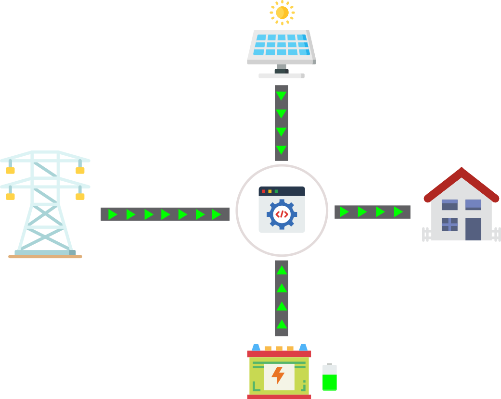
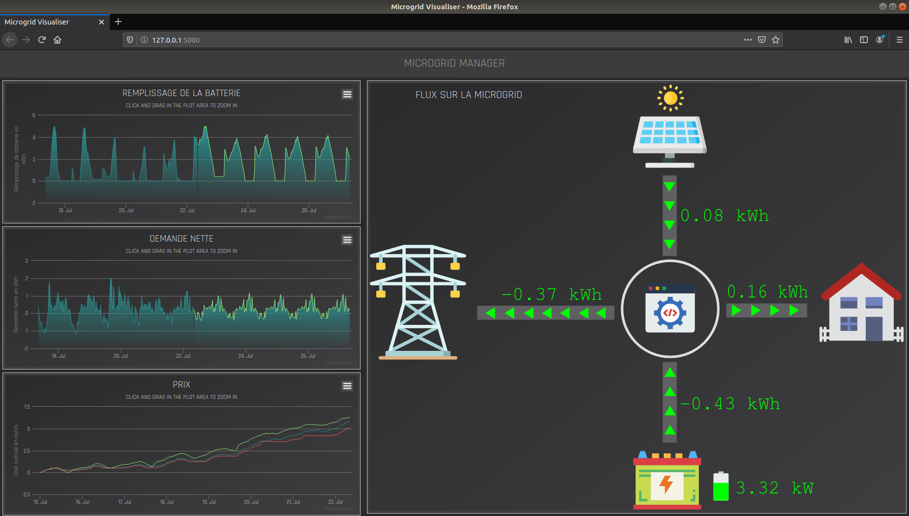

# Microgrid-Manager

## Introduction

This project is an academic project carried out during the second semester of 2019-2020.
I worked on this project alone and was overseen by a Phd student, Adrien Le Franc.

The goal of this project is to manage a battery in a microgrid fitted with a solar pannel.

This method uses the command predictive control method: at every step:
  1. we predict the net demand (difference between the demand and the production) in the microgrid for two weeks
  2. we set the trajectory battery load in order to minimize the total cost.
  3. only the first value of the prescription is retained

To have more details about this project, I invite you to read my report, in the .pdf file.

The main language used here is Python (with Numpy, Matplotlib, statsmodels, Pulp, Flask) but I also use HTML, JS and CSS for the dashboard

This method presents various file among which, what may be the most interesting are :
  - `param.py`, where is saved all the configuration of the file
  - `forecast.py`, containing the prediction methods
  - `optimisation.py`, containing the optimisation problem
  - `compute_result.py` that saves the interesting results for plot in .npy files
  - `plot.py` where we can draw the plot that appear in my report
  - `app.py` that **launches the dashboard**
  - `tools.py` contains tools. I have copied this file from an older project. Thus, some functions in this file are not used. 

You'll have to execute either app.py, plot.py, compute_result.py

## First execution

Once you've cloned the program, before your first execution, please set `REFIT_MODEL` to `True` in the file `param.py`. It will compute the fitted model for the prediction method and save it in a .pkl file in the save folder. Then, you can set `REFIT_MODEL` to `False` again.

## The data

The data comes from the website of the Australian compagny Ausgrid.com. [Click here for the data](https://www.ausgrid.com.au/Industry/Our-Research/Data-to-share/Solar-home-electricity-data)
